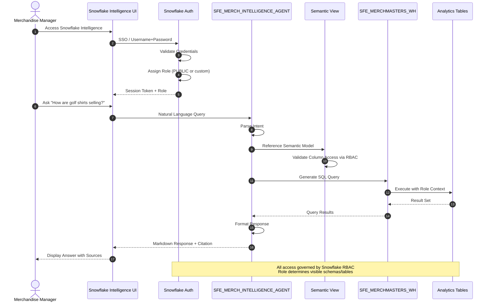

# Auth Flow - MerchMasters

**Author:** SE Community
**Last Updated:** 2025-12-01
**Expires:** 2026-01-31 (30 days)
**Status:** Reference Implementation


> **Reference Implementation:** This code demonstrates production-grade architectural patterns and best practices. Review and customize security, networking, and logic for your organization's specific requirements before deployment.

## Overview

This diagram shows the authentication and authorization flow for the MerchMasters demo. Users authenticate through Snowflake's standard mechanisms (SSO or username/password), and all data access is governed by Snowflake's Role-Based Access Control (RBAC).



## Component Descriptions

### Authentication Components

#### Snowflake Auth
- **Purpose:** Validate user identity and establish session
- **Technology:** Snowflake Authentication Service
- **Methods Supported:**
  - SSO (SAML 2.0, OAuth)
  - Username/Password
  - Key-Pair Authentication
- **Session Output:** JWT token with role context

#### User Roles
- **PUBLIC:** Default role with access to demo objects
- **Custom Roles:** Can be created for granular access control
- **Required Grants:**
  - USAGE on SNOWFLAKE_EXAMPLE database
  - USAGE on SFE_MERCH_* schemas
  - SELECT on all analytics tables
  - USAGE on SFE_MERCHMASTERS_WH warehouse
  - USAGE on SFE_MERCH_INTELLIGENCE_AGENT

### Authorization Flow

#### Step-by-Step Process

1. **User Authentication**
   - User navigates to Snowflake Intelligence in Snowsight
   - Snowflake validates credentials (SSO or direct login)
   - Session established with assigned role

2. **Query Submission**
   - User types natural language question
   - UI forwards to SFE_MERCH_INTELLIGENCE_AGENT

3. **Intent Parsing**
   - Agent parses the natural language query
   - Determines relevant dimensions, facts, metrics

4. **Semantic Model Access**
   - Agent references SFE_SV_MERCH_INTELLIGENCE semantic view
   - RBAC validates user has access to underlying tables

5. **SQL Generation & Execution**
   - Agent generates SQL based on semantic model
   - Warehouse executes query with user's role context
   - Only accessible data is returned

6. **Response Formatting**
   - Agent formats results as Markdown
   - Includes citations (data sources, freshness)
   - Returns to user through UI

## RBAC Configuration

### Required Grants for Demo Users

```sql
-- Grant access to demo database
GRANT USAGE ON DATABASE SNOWFLAKE_EXAMPLE TO ROLE PUBLIC;

-- Grant access to schemas
GRANT USAGE ON SCHEMA SNOWFLAKE_EXAMPLE.SFE_MERCH_ANALYTICS TO ROLE PUBLIC;
GRANT USAGE ON SCHEMA SNOWFLAKE_EXAMPLE.SEMANTIC_MODELS TO ROLE PUBLIC;

-- Grant SELECT on analytics tables
GRANT SELECT ON ALL TABLES IN SCHEMA SNOWFLAKE_EXAMPLE.SFE_MERCH_ANALYTICS TO ROLE PUBLIC;
GRANT SELECT ON ALL VIEWS IN SCHEMA SNOWFLAKE_EXAMPLE.SEMANTIC_MODELS TO ROLE PUBLIC;

-- Grant warehouse usage
GRANT USAGE ON WAREHOUSE SFE_MERCHMASTERS_WH TO ROLE PUBLIC;
```

### Semantic View RBAC

The semantic view (`SFE_SV_MERCH_INTELLIGENCE`) respects underlying table permissions:
- User must have SELECT on all referenced tables
- Column-level access can be restricted at the table level
- Semantic view does not bypass RBAC

## Security Boundaries

### Data Classification

| Data Type | Classification | Access Control |
|-----------|---------------|----------------|
| Product Catalog | Internal | PUBLIC role |
| Sales Transactions | Internal | PUBLIC role |
| Inventory Levels | Internal | PUBLIC role |
| Pricing Data | Internal | PUBLIC role |

**Note:** This demo uses synthetic data with no PII or sensitive information.

### Audit Trail

Snowflake automatically logs:
- User authentication events
- Query execution history
- Object access patterns
- Role usage

Access via: `SNOWFLAKE.ACCOUNT_USAGE.QUERY_HISTORY`

## Authentication Methods Summary

| Method | Use Case | Configuration |
|--------|----------|---------------|
| SSO | Enterprise users | Configure SAML 2.0 IdP |
| Username/Password | Demo/testing | Default (least secure) |
| Key-Pair | Automation | Upload public key to user |
| OAuth | API access | Configure OAuth integration |

## Change History

See `.cursor/DIAGRAM_CHANGELOG.md` for version history.
