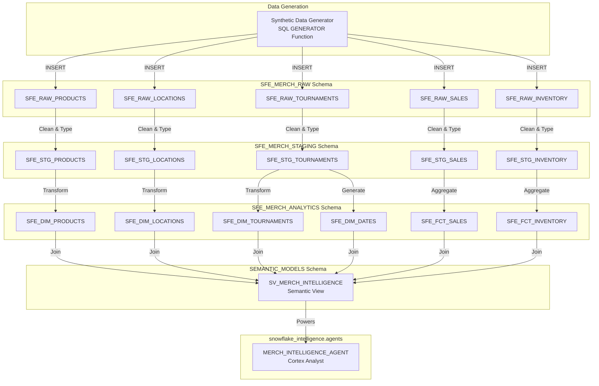

# Data Flow - MerchMasters

**Author:** SE Community  
**Last Updated:** 2025-12-01  
**Expires:** 2025-12-31 (30 days)  
**Status:** Reference Implementation

> **Reference Implementation:** This code demonstrates production-grade architectural patterns and best practices. Review and customize security, networking, and logic for your organization's specific requirements before deployment.

## Overview

This diagram shows how data flows through the MerchMasters system, from synthetic data generation through the RAW, STAGING, and ANALYTICS layers to the Cortex Analyst semantic model that powers natural language queries.

## Component Descriptions

### Data Generation Layer

#### Synthetic Data Generator
- **Purpose:** Creates realistic POS and inventory data for demo purposes
- **Technology:** Snowflake GENERATOR() function with random seed
- **Location:** `sql/02_data/02_load_sample_data.sql`
- **Dependencies:** Schema must exist first
- **Output:** ~100,000 transaction records, product catalog, inventory snapshots

### RAW Layer (SFE_MERCH_RAW Schema)

| Table | Purpose | Volume |
|-------|---------|--------|
| SFE_RAW_PRODUCTS | Product catalog landing | ~500 styles |
| SFE_RAW_LOCATIONS | Location master landing | 4 locations |
| SFE_RAW_TOURNAMENTS | Tournament calendar landing | 2 tournaments |
| SFE_RAW_SALES | POS transaction landing | ~100K records |
| SFE_RAW_INVENTORY | Inventory snapshot landing | ~10K records |

### STAGING Layer (SFE_MERCH_STAGING Schema)

- **Purpose:** Clean, validate, and type-cast raw data
- **Technology:** Snowflake views or tables with transformations
- **Transformations Applied:**
  - Data type casting (strings to dates, numbers)
  - NULL handling and defaults
  - Data quality filters
  - Deduplication

### ANALYTICS Layer (SFE_MERCH_ANALYTICS Schema)

- **Purpose:** Star schema optimized for analytical queries
- **Technology:** Snowflake tables with proper clustering
- **Components:**
  - 4 Dimension tables (Products, Locations, Tournaments, Dates)
  - 2 Fact tables (Sales, Inventory)

### Semantic Layer (SEMANTIC_MODELS Schema)

#### SV_MERCH_INTELLIGENCE
- **Purpose:** Define business-friendly model for Cortex Analyst
- **Technology:** Snowflake Semantic View (CREATE SEMANTIC VIEW)
- **Location:** `SNOWFLAKE_EXAMPLE.SEMANTIC_MODELS.SV_MERCH_INTELLIGENCE`
- **Contents:**
  - Dimension definitions with synonyms
  - Fact definitions with units
  - Metric definitions (aggregations)
  - Time filters (LAST_7_DAYS, YTD, etc.)
  - Custom business instructions

### Agent Layer

#### MERCH_INTELLIGENCE_AGENT
- **Purpose:** Natural language interface for merchandise queries
- **Technology:** Snowflake Cortex Analyst
- **Location:** `snowflake_intelligence.agents.MERCH_INTELLIGENCE_AGENT`
- **Sample Questions:** Maps 1:1 to verified queries in semantic view

## Data Transformation Summary

| Stage | Input | Transformation | Output |
|-------|-------|----------------|--------|
| Generate | GENERATOR() | Create synthetic records | RAW tables |
| Clean | RAW tables | Type cast, validate, dedupe | STAGING tables |
| Model | STAGING tables | Star schema transform | ANALYTICS tables |
| Semantic | ANALYTICS tables | Join & define business terms | Semantic View |
| Agent | Semantic View | Link to Cortex Analyst | Natural Language Q&A |

## Change History

See `.cursor/DIAGRAM_CHANGELOG.md` for version history.

