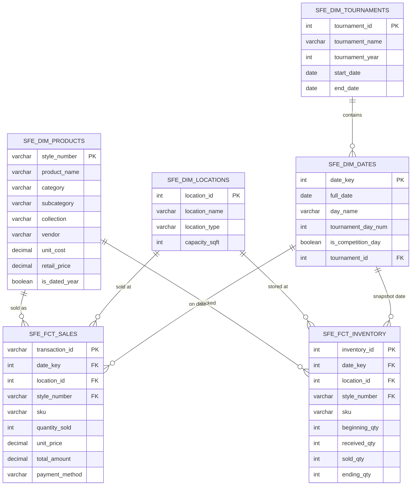

# Data Model - MerchMasters

**Author:** SE Community
**Last Updated:** 2025-12-01
**Expires:** 2026-04-10 (30 days)
**Status:** Reference Implementation

> **Reference Implementation:** This code demonstrates production-grade architectural patterns and best practices. Review and customize security, networking, and logic for your organization's specific requirements before deployment.

## Overview

This diagram shows the star schema data model for the MerchMasters tournament merchandise analytics system. The model consists of 4 dimension tables (Products, Locations, Tournaments, Dates) and 2 fact tables (Sales, Inventory) optimized for Cortex Analyst queries.

## Component Descriptions

### Dimension Tables

#### SFE_DIM_PRODUCTS
- **Purpose:** Master product catalog with style numbers, categories, and pricing
- **Technology:** Snowflake table in SFE_MERCH_ANALYTICS schema
- **Location:** `SNOWFLAKE_EXAMPLE.SFE_MERCH_ANALYTICS.SFE_DIM_PRODUCTS`
- **Dependencies:** Source data from SFE_MERCH_RAW.SFE_RAW_PRODUCTS
- **Key Fields:**
  - `style_number` - Primary key, unique product identifier (e.g., "GS-2024-BLU")
  - `category` - Product category (Shirts, Hats, Drinkware, Accessories)
  - `is_dated_year` - Flag for tournament-dated merchandise

#### SFE_DIM_LOCATIONS
- **Purpose:** Retail location master with store types and capacities
- **Technology:** Snowflake table in SFE_MERCH_ANALYTICS schema
- **Location:** `SNOWFLAKE_EXAMPLE.SFE_MERCH_ANALYTICS.SFE_DIM_LOCATIONS`
- **Dependencies:** Source data from SFE_MERCH_RAW.SFE_RAW_LOCATIONS
- **Key Fields:**
  - `location_id` - Primary key
  - `location_type` - Pro Shop, Tournament Tent, Clubhouse

#### SFE_DIM_TOURNAMENTS
- **Purpose:** Tournament calendar with dates and years
- **Technology:** Snowflake table in SFE_MERCH_ANALYTICS schema
- **Location:** `SNOWFLAKE_EXAMPLE.SFE_MERCH_ANALYTICS.SFE_DIM_TOURNAMENTS`
- **Dependencies:** Source data from SFE_MERCH_RAW.SFE_RAW_TOURNAMENTS

#### SFE_DIM_DATES
- **Purpose:** Date dimension with tournament context (day number, competition flag)
- **Technology:** Snowflake table in SFE_MERCH_ANALYTICS schema
- **Location:** `SNOWFLAKE_EXAMPLE.SFE_MERCH_ANALYTICS.SFE_DIM_DATES`
- **Dependencies:** Generated from tournament date ranges

### Fact Tables

#### SFE_FCT_SALES
- **Purpose:** Point-of-sale transaction facts with quantities and amounts
- **Technology:** Snowflake table in SFE_MERCH_ANALYTICS schema
- **Location:** `SNOWFLAKE_EXAMPLE.SFE_MERCH_ANALYTICS.SFE_FCT_SALES`
- **Dependencies:** All dimension tables
- **Grain:** One row per transaction line item
- **Volume:** ~100,000 records across 2 tournaments

#### SFE_FCT_INVENTORY
- **Purpose:** Daily inventory snapshots by location and SKU
- **Technology:** Snowflake table in SFE_MERCH_ANALYTICS schema
- **Location:** `SNOWFLAKE_EXAMPLE.SFE_MERCH_ANALYTICS.SFE_FCT_INVENTORY`
- **Dependencies:** All dimension tables
- **Grain:** One row per location/SKU/day

## Data Lineage

| Layer | Tables | Purpose |
|-------|--------|---------|
| RAW | SFE_RAW_* | Synthetic data landing |
| STAGING | SFE_STG_* | Cleaned and typed |
| ANALYTICS | SFE_DIM_*, SFE_FCT_* | Star schema for analysis |

## Change History

See `.cursor/DIAGRAM_CHANGELOG.md` for version history.
