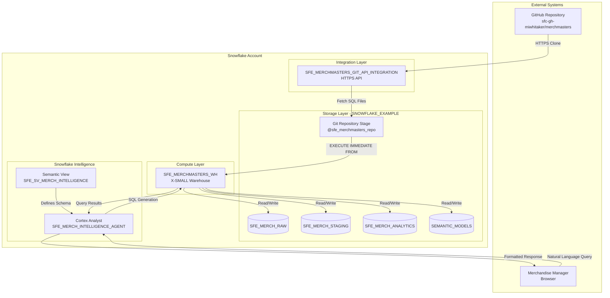

# Network Flow - MerchMasters

**Author:** SE Community
**Last Updated:** 2025-12-02
**Expires:** 2026-01-31 (30 days)
**Status:** Reference Implementation

> **Reference Implementation:** This code demonstrates production-grade architectural patterns and best practices. Review and customize security, networking, and logic for your organization's specific requirements before deployment.

## Overview

This diagram shows the network architecture for the MerchMasters demo, which is 100% Snowflake native. The only external dependency is the GitHub repository for code deployment. All data processing, storage, and intelligence features run within Snowflake.

## Component Descriptions

### External Systems

#### GitHub Repository
- **Purpose:** Source code repository for SQL scripts and deployment files
- **Technology:** GitHub (public repository)
- **URL:** https://github.com/sfc-gh-miwhitaker/merchmasters
- **Protocol:** HTTPS (port 443)
- **Access:** Read-only via API Integration

#### User Browser
- **Purpose:** Merchandise manager accessing Snowflake Intelligence
- **Technology:** Web browser (Chrome, Safari, Firefox, Edge)
- **Protocol:** HTTPS to Snowsight
- **Authentication:** Snowflake SSO or username/password

### Integration Layer

#### SFE_MERCHMASTERS_GIT_API_INTEGRATION
- **Purpose:** Secure connection between Snowflake and GitHub
- **Technology:** Snowflake API Integration (git_https_api)
- **Location:** Account-level object
- **Protocol:** HTTPS (port 443)
- **Allowed Prefixes:** https://github.com/sfc-gh-miwhitaker/
- **Permissions:** Read-only access to public repositories

### Compute Layer

#### SFE_MERCHMASTERS_WH
- **Purpose:** Execute SQL queries and transformations
- **Technology:** Snowflake Virtual Warehouse
- **Size:** X-SMALL (1 credit/hour when active)
- **Auto-Suspend:** 60 seconds
- **Auto-Resume:** Yes
- **Scaling:** Single cluster

### Storage Layer (SNOWFLAKE_EXAMPLE Database)

#### Git Repository Stage (@sfe_merchmasters_repo)
- **Purpose:** Reference to cloned GitHub repository
- **Technology:** Snowflake Git Repository object
- **Location:** SNOWFLAKE_EXAMPLE.MERCHMASTERS_GIT_REPOS.sfe_merchmasters_repo
- **Content:** SQL scripts, documentation, configuration

#### Schema Storage
- **SFE_MERCH_RAW:** Raw synthetic data (~10MB)
- **SFE_MERCH_STAGING:** Cleaned data (~8MB)
- **SFE_MERCH_ANALYTICS:** Star schema (~15MB)
- **SEMANTIC_MODELS:** Semantic view definitions (<1MB)

### Intelligence Layer

#### SFE_SV_MERCH_INTELLIGENCE (Semantic View)
- **Purpose:** Business-friendly data model for Cortex Analyst
- **Technology:** Snowflake Semantic View
- **Location:** SNOWFLAKE_EXAMPLE.SEMANTIC_MODELS.SFE_SV_MERCH_INTELLIGENCE
- **Defines:** Dimensions, facts, metrics, time filters

#### SFE_MERCH_INTELLIGENCE_AGENT (Cortex Analyst)
- **Purpose:** Natural language query interface
- **Technology:** Snowflake Intelligence / Cortex Analyst
- **Location:** SNOWFLAKE_EXAMPLE.MERCHMASTERS.SFE_MERCH_INTELLIGENCE_AGENT
- **Visibility:** Managed by SNOWFLAKE_INTELLIGENCE_OBJECT_DEFAULT
- **Model:** Automatic selection (Snowflake managed)

## Network Security

### Inbound Connections
- Users → Snowsight (HTTPS, Snowflake-managed)
- No direct database connections exposed

### Outbound Connections
- Snowflake → GitHub API (HTTPS, controlled by API Integration)
- No other external connections required

### Data Security
- All data remains within Snowflake
- RBAC controls access to schemas and objects
- No PII in synthetic demo data

## Port Summary

| Connection | Protocol | Port | Direction |
|------------|----------|------|-----------|
| User → Snowsight | HTTPS | 443 | Inbound |
| Snowflake → GitHub | HTTPS | 443 | Outbound |

## Change History

See `.cursor/DIAGRAM_CHANGELOG.md` for version history.
